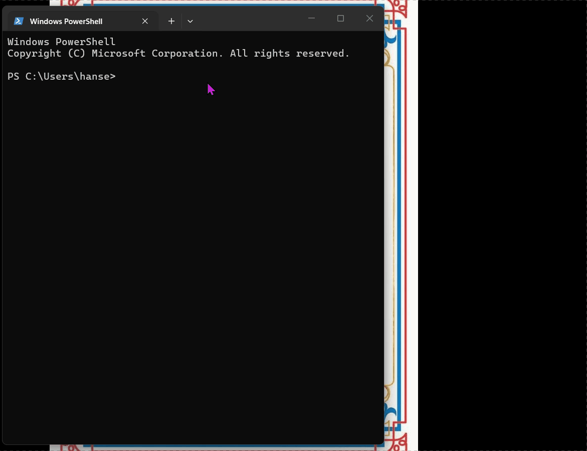

# 📚 pyquiz
## 🌐 Repository

Source code:


👉 https://github.com/hansemso/pyquiz


# PyQuiz customizable flashcard/quiz app
👉 For full details on development:  https://github.com/hansemso/pyquiz/blob/main/devlog.md


🎯 Overview

PyQuiz is a Python CLI flashcard app using JSON-based persistent storage. Made for self-study with my problems. However, anybody can modify and use. Goal was to build a easy-to-troubleshoot app that is expandable. Developed and updated regularly.  


## ✨ FEATURES/How to use:

✅ Fully modularized structure for easy debugging and modification. Uses Python 3.

✅ Type I cards: Multiline problem display; groupable QA's with single line qa input. 
	- Can add single-line text, such as Chinese characters, and Tkinter popup will zoom up for better viewing. Just turn toggle on in edit mode.

✅ Type II: Multi-line problem display; multi-line answer input for exercises;extra QA input. 

✅ Index with range selector with on/off auto shuffle per range.

✅ Instant grading feedback per problem, total result at end.

✅ Local JSON storage. Can connect to sql and add data analysis scripts

✅ Use [enter] or type "EXIT" to exit loops in app, also "END" to finish input.  

✅ pyquiz\repl folder contains machine learning and other exercises to run in Python 3. Follow instructions on flashcard. 


## 🎬 Demo   (A quick tour of how pyquiz works)




## 📜 MENU

✅ 1-999: Python or Javascript problems
✅ 1000-1999: Machine Learning problems
✅ 10000-11000: hanja


## 📥 Installation

### 1. Clone the Repository

Open terminal and run:

```bash
git clone https://github.com/hansemso/pyquiz.git
```

Enter project folder:

```bash
cd pyquiz
```

### 2. Install Python (If Needed)

Make sure Python 3 is installed.


### 3. Run the Application

Start the quiz app with:

```bash
py main.py
```


## 💾 Data Storage

* Study cards are stored locally in JSON format.
* Your progress is saved automatically.


## 🛠 Technology Stack

* Python
* CLI Interface
* JSON Persistence


